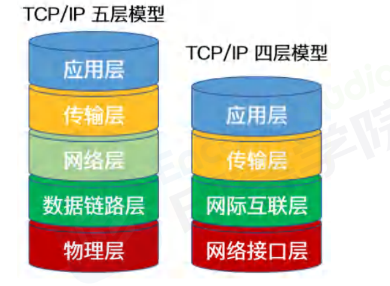
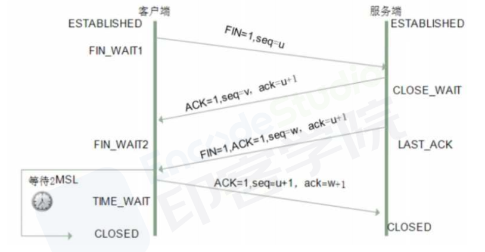
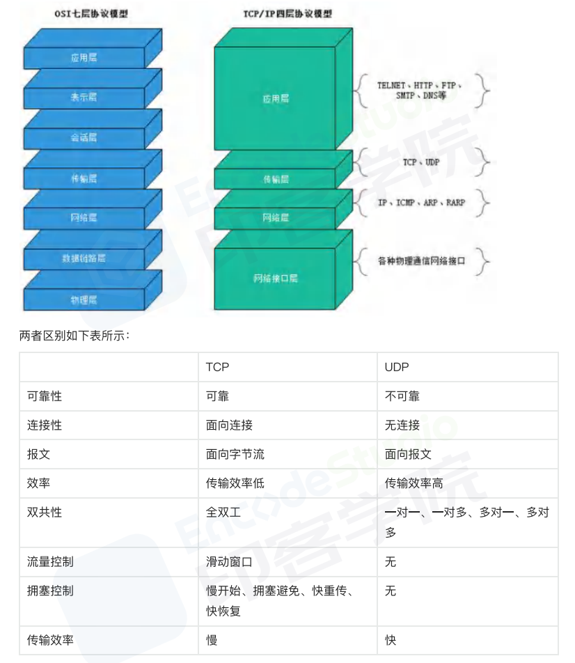

## TCP

TCP(Transmission Control Protocol)，传输控制协议，是一种可靠、`面向字节流`的通信协议，把上面应用层交下来的数据看成无结构的字节流来发送

可以想象成流水形式的，发送方TCP会将数据放入“蓄水池”(缓存区)，等到可以发送的时候就发送不能发送就等着，TCP会根据当前网络的拥塞状态来确定每个报文段的大小

特点如下

- TCP充分地实现了数据传输时各种控制功能，可以进行丢包时的重发控制，还可以对次序乱掉的分包进行顺序控制。而这些在 UDP 中都没有。
- 此外，TCP 作为一种`面向有连接`的协议，只有在`确认通信`对端存在时才会发送数据，从而可以控制通信流量的浪费。
- 根据 TCP 的这些机制，在 IP 这种无连接的网络上也能够实现高可靠性的通信(主要通过检验和序列号、确认应答、重发控制、连接管理以及窗口控制等机制实现)

# TCP/IP 协议

TCP/IP，传输控制协议/网际协议，是指能够在多个不同网络间实现信息传输的协议

- TCP(传输控制协议)
  一种面向`连接的`、`可靠的`、`基于字节流`的传输层通信协议

- IP(网际协议)
  
 用于封包交换数据网络的协议

TCP/IP协议不仅仅指的是TCP和IP两个协议，而是指一个由FTP、SMTPTCP、UDP、IP 等协议构成的协议，

只是因为在 TCP/IP 协议中 TCP 协议和IP 协议最具代表性，所以通称为TCP/IP协议族(英语:TCP/IP Protocol Suite，或TCP/IP Protocols)

## TCP/IP 五层体系

- 应用层：应用层、表示层、会话层：HTTP
- 传输层：TCP/UDP
- 网络层：IP
- 数据链路层：数据链路层、物理层
- 物理层

## TCP/IP 四层体系

- 应用层
- 传输层
- 网际互联层
- 网络接口层

# TCP 三次握手

TCP 协议通过三次握手建立可靠的点对点连接，具体过程是：
首先服务器进入监听状态，然后即可处理连接

- 第一次握手：建立连接时，客户端发送 syn 包到服务器，并进入 `SYN_SENT` 状态，等待服务器确认。在发送的包中还会包含一个初始序列号 seq。此次握手的含义是客户端希望与服务器建立连接。
- 第二次握手：服务器收到 syn 包，然后回应给客户端一个` SYN+ACK` 包，此时服务器进入 `SYN_RCVD` 状态。此次握手的含义是服务端回应客户端，表示已收到并同意客户端的连接请求。
- 第三次握手：客户端收到服务器的 SYN 包后，向服务器再次发送 ACK 包，并进入 `ESTAB_LISHED` 状态。
- 最后，服务端收到客户端的 ACK 包，于是也进入 `ESTAB_LISHED` 状态，至此，连接建立完成

## 那为什么要三次握手呢？两次不行吗？

为了确认双方的接收能力和发送能力都正常

如果是用两次握手，则会出现下面这种情况：

- 两次握手，发送端可以确保自己的发的信息接收端能收到，也能确保接收端发的包自己能收到，但接收端只能确保对方发的包自己能收到，`无法确定自己发的包是否能被对方收到`。

- 防止已失效的连接请求:
如客户端发出连接请求，但因连接请求报文丢失而未收到确认，于是客户端再重传一次连接请求。后来收到了确认，建立了连接。数据传输完毕后，就释放了连接，客户端共发出了两个连接请求报文段，其中第一个丢失，第二个到达了服务端，但是第一个丢失的报文段只是在某些网络结点长时间滞留了，延误到连接释放以后的某个时间才到达服务端，此时服务端误认为客户端又发出一次新的连接请求，
于是就向客户端发出确认报文段，同意建立连接，不采用三次握手，只要服务端发出确认，就建立新的连接了，此时客户端忽略服务端发来的确认，也不发送数据，则服务端一致等待客户端发送数据，浪费资源。

- 避免中间人攻击

如果只需要两次握手，中间人攻击者可以截取了客户端的SYN报文，伪造第二次握手（SYN+ACK），使服务器认为连接已建立，但实际上客户端并未收到这个响应。通过这种方式，攻击者可以中断连接，或者在客户端和服务器之间插入自己，造成安全问题。

# 三次握手过程中可以携带数据吗

- 第一次、第二次握手不可以携带数据，因为一握二握时还没有建立连接，会让服务器容易受到攻击
- 而第三次握手，此时客户端已经处于 ESTABLISHED (已建立连接状态) ，对于客户端来说，已经建立起连接了，并且也已经知道服务器的接收、发送能力是正常的了，所以能携带数据也是没问题的。

# TCP 四次挥手

- Client 向 Server 发送 `FIN` 包，表示 Client 主动要关闭连接，然后进入` FIN_WAIT_1` 状态，等待 `Server` 返回 `ACK` 包。此后 `Client` 不能再向 `Server` 发送数据，但能读取数据。
- Server 收到 `FIN` 包后向 Client 发送 `ACK` 包，然后进入 `CLOSE_WAIT` 状态，此后 `Server` 不能再读取数据，但可以继续向 `Client` 发送数据。
- Client 收到 Server 返回的 `ACK` 包后进入 `FIN_WAIT_2` 状态，等待 Server 发送 FIN 包。
- Server 完成数据的发送后，将 `FIN` 包发送给 `Client`，然后进入 `LAST_ACK` 状态，等待 Client 返回 `ACK` 包，此后 `Server` 既不能读取数据，也不能发送数据。
- Client 收到 `FIN` 包后向 `Server` 发送 ACK 包，然后进入 `TIME_WAIT 状态`，接着等待足够长的时间`（2MSL）`以确保 Server 接收到 ACK 包，最后回到 `CLOSED` 状态，释放网络资源。
- Server 收到 Client 返回的 `ACK` 包后便回到 CLOSED 状态，释放网络资源

## 为什么客户端在第四次挥手后还会等待 2MSL？
MSL：报文段最大生存时间，它是任何报文段被丢弃前在网络内的最长时间。有以下两个原因：

等待 2MSL 是因为保证服务端接收到了 ACK 报文，因为网络是复杂了，很有可能 ACK 报文丢失了，如果服务端没接收到 ACK 报文的话，会重新发送 FIN 报文，只有当客户端等待了 2MSL 都没有收到重发的 FIN 报文时就表示服务端是正常收到了 ACK 报文，那么这个时候客户端就可以关闭了。

## 为什么要四次挥手？

TCP是全双工通信，不能单方面完全断开连接

为什么握手要三次，挥手却要四次呢？那是因为握手的时候并没有数据传输，所以服务端的 SYN 和 ACK 报文可以一起发送，但是挥手的时候有数据在传输，所以 ACK 和 FIN 报文不能同时发送，需要分两步，所以会比握手多一步

为什么不能是三次，不能像建立连接那样把第二次和第三次合并成一次？

因为在第二次请求时服务端向客户端发送确认关闭连接，此时服务端可能还有一些数据没有传输完成，需要继续向客户端发送数据，不能跟合并服务器向客户端发送的关闭连接请求，所以需要拆分成两个连接请求

# TCP滑动窗口是什么

TCP滑动窗口是TCP（传输控制协议）用于实现流量控制的一种机制。它允许发送方和接收方根据网络的当前状态`动态地调整发送的数据量`，以此优化网络的利用率和避免拥塞。滑动窗口机制确保了数据传输的可靠性和效率，是TCP协议中非常重要的一部分。

## 工作原理

在TCP连接中，滑动窗口分为发送窗口和接收窗口：

- 发送窗口定义了发送方可以发送但尚未收到确认的数据量。它的大小决定了在等待确认的同时，发送方能发送多少额外的数据。
- 接收窗口则是接收方告诉发送方它在不接收进一步数据的情况下能够接收的最大数据量。

窗口的“滑动”指的是随着数据的确认，窗口会向前移动，允许发送或接收更多的数据。这个过程如下：

1. 发送方根据接收方给出的窗口大小，发送一系列的数据段。
2. 接收方在成功接收数据后，会向发送方确认，并可能通知一个新的窗口大小。
3. 发送方接收到确认后，会“滑动”其窗口，允许发送更多的数据。

## 窗口大小调整
窗口缩小：如果接收方的可用缓冲区减少，它会通过TCP报头中的窗口大小字段通知发送方减少窗口大小。
窗口增大：当接收方处理了一些数据并释放了缓冲区空间后，它可以增加窗口的大小，允许发送方增加发送速率。

## 拥塞控制
滑动窗口还与TCP的拥塞控制机制紧密相关。TCP使用一系列算法（如慢启动、拥塞避免、快重传和快恢复）来调整窗口大小，以响应网络中的拥塞情况。这确保了即使在网络条件变化时，TCP连接也能有效地利用网络资源，同时避免过度拥塞。

## 重要性
TCP滑动窗口机制通过动态调整数据传输速率，有效地平衡了高效数据传输和网络拥塞控制的需要。它是实现TCP可靠、顺序且基于速率的数据传输的关键技术。

# TCP重试机制

TCP（传输控制协议）重试机制是一种错误控制策略，用来确保数据能够可靠地在网络中传输。TCP是一种面向连接的、可靠的传输层协议，它通过一系列机制（包括重试）来保证数据的顺序传输、数据完整性以及错误的检测和恢复。TCP重试主要涉及以下几个方面：

1. 超时重传（Retransmission Timeout, RTO）
当TCP发送一个数据段后，它会启动一个定时器（称为重传定时器）。如果在定时器超时之前没有收到对该数据段的确认（ACK），发送方假定该数据段在传输过程中丢失或被破坏，并将该数据段重新发送。TCP使用一种自适应的重传超时算法来动态调整重传定时器的超时时间，以适应网络条件的变化。

2. 快速重传（Fast Retransmit）
除了基于超时的重传之外，TCP还实现了快速重传机制。当发送方接收到三个重复的ACK（表明接收方收到了期望的序列号之后的某个特定数据段，但该数据段之前的某些数据还没有收到），它会立即重新传输这些丢失的数据段，而不是等待重传定时器超时。这种机制可以更快地响应丢包，减少等待时间。

3. 超时时间的计算
TCP的超时时间不是固定的，而是基于网络的往返时间（RTT）动态计算的。TCP估算RTT，并根据这个估算及其波动来调整重传超时时间（RTO）。这保证了在网络条件变化时，超时重传机制仍然能有效地工作。

4. 拥塞控制与重试
TCP重试机制与拥塞控制密切相关。当发生重传时，TCP会将其视为网络拥塞的迹象，并通过调整其拥塞窗口大小来减少网络中的数据流量，以此来缓解拥塞。随着数据成功传输和确认，拥塞窗口可以逐渐增大，直到达到网络能够支持的最大值。

5. 保持活动检测（Keepalive）
TCP还可以配置使用保持活动检测机制，定期发送探测消息以确定对端是否仍然可达。这不是重试机制的直接部分，但与确保连接的持久性和可靠性有关。

TCP通过这些重试和错误控制机制，提供了一种可靠的数据传输服务。这些机制共同确保了数据能够按顺序、完整地传输到目的地，即使在网络条件不稳定的情况下也能适应和恢复。

## 区别

- TCP 是面向连接的协议，建立连接3次握手、断开连接四次挥手，UDP是面向无连接，数据传输前后不连接连接，发送端只负责将数据发送到网络，接收端从消息队列读取
- TCP 提供可靠的服务，传输过程采用流量控制、编号与确认、计时器等手段确保数据无差错，不丢失。
- UDP 则尽可能传递数据，但不保证传递交付给对方
- TCP 面向`字节流`，将应用层报文看成一串无结构的字节流，分解为多个TCP报文段传输后，在目的站重新装配。UDP协议面向`报文`，不拆分应用层报文，只保留报文边界，一次发送一个报文，接收方去除报文首部后，原封不动将报文交给上层应用
- TCP 只能是` 1 对 1 `的，UDP 支持` 1 对 1`,`1 对多`
- TCP 的首部较大为 20 字节，而 UDP 只有 8 字节
- TCP 是面向连接的可靠性传输，而 UDP 是不可靠的
