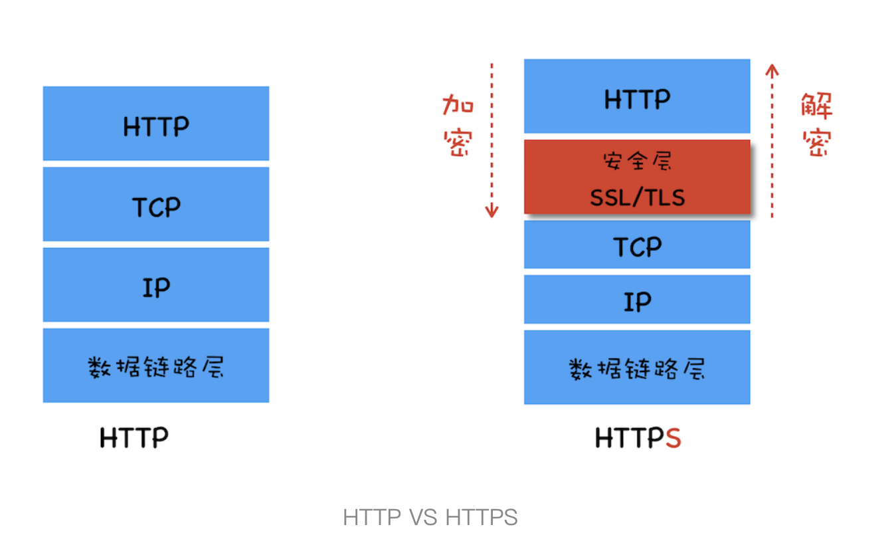
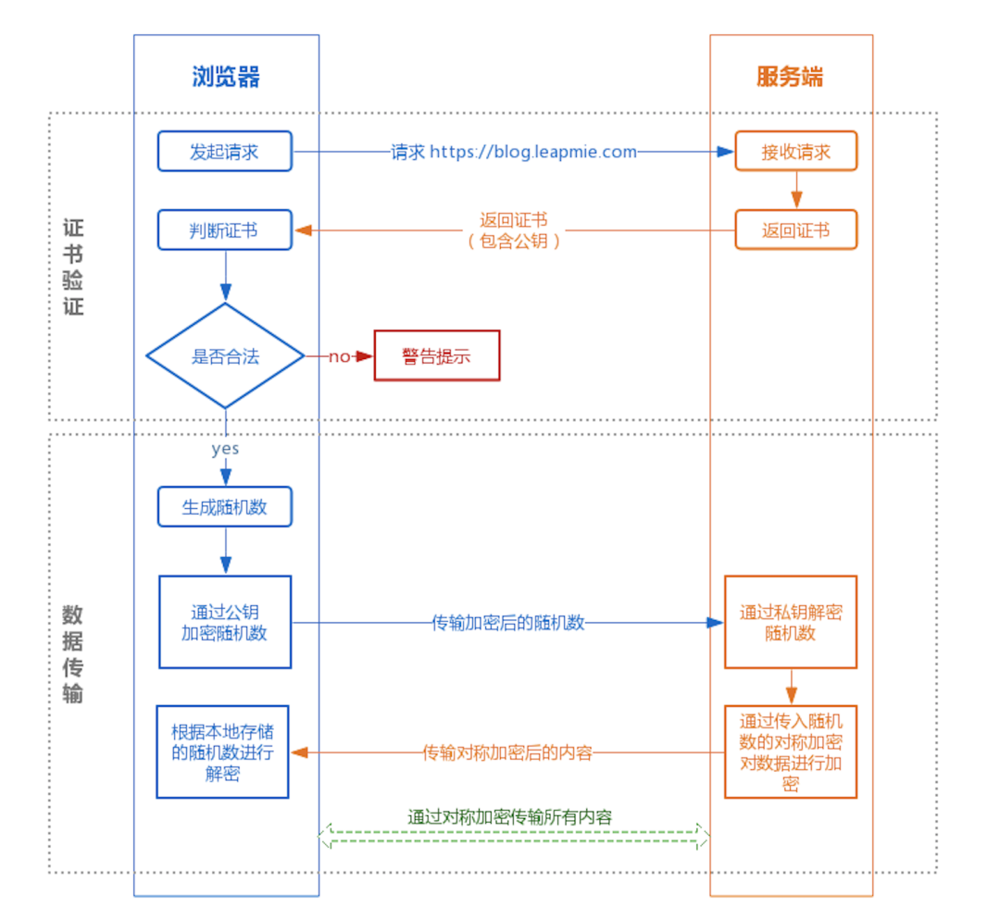
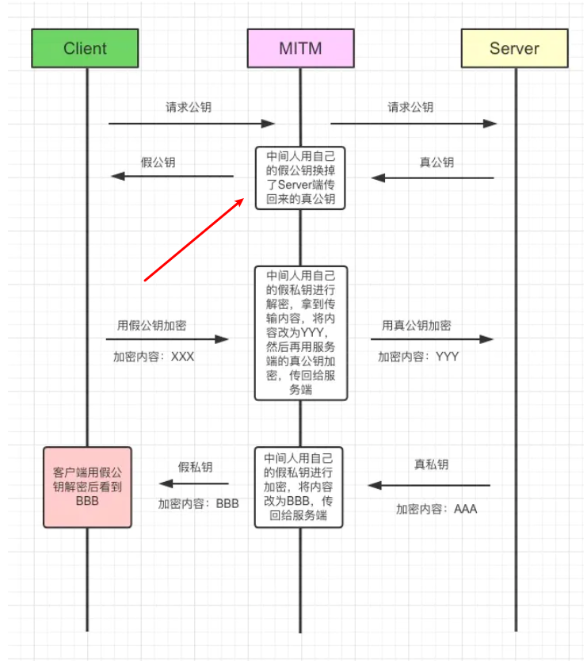
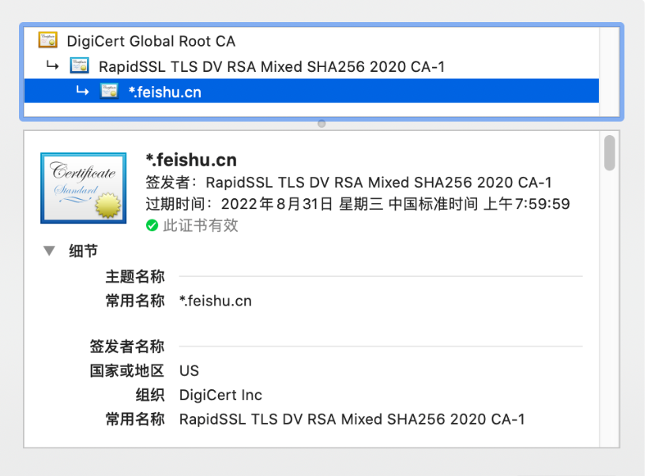
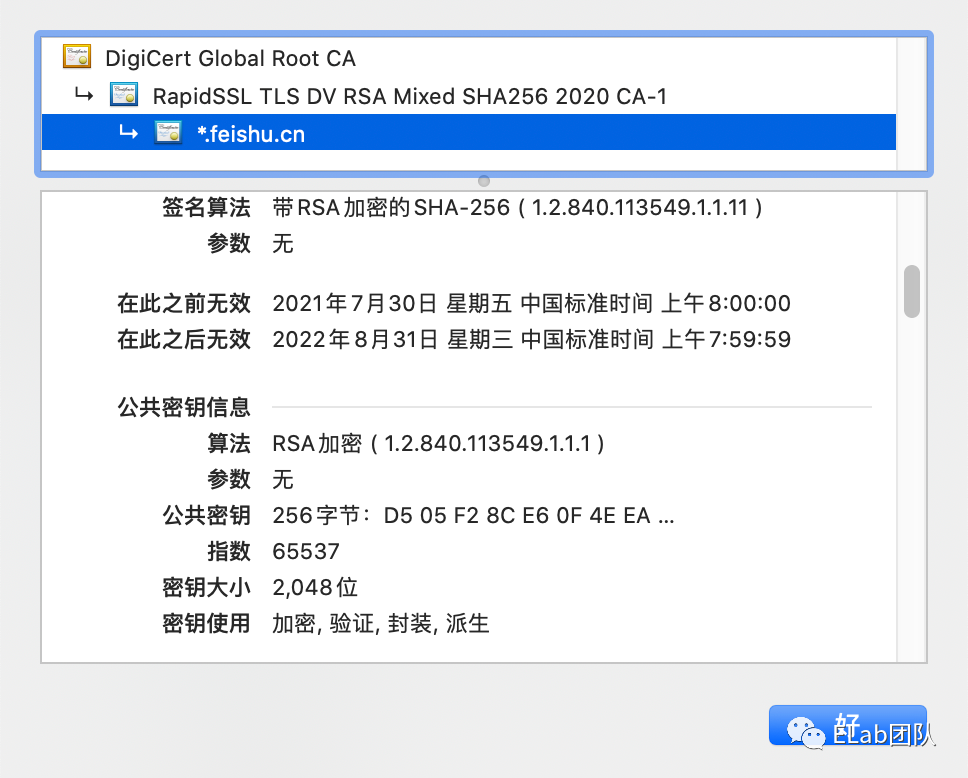
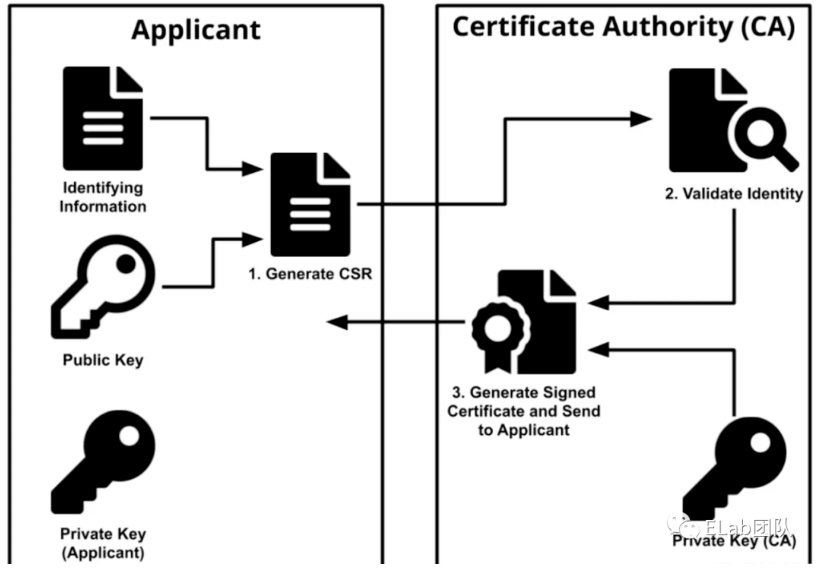
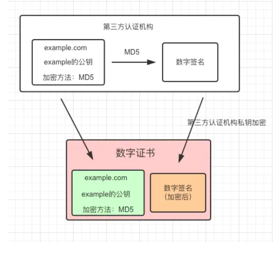
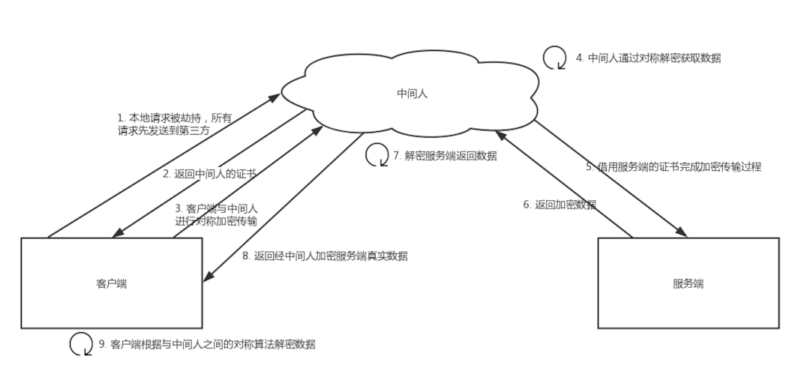

# https 与 http 的区别?

HTTPS 要比 HTTPS 多了 secure 安全性这个概念，实际上， HTTPS 并不是一个新的应用层协议，它其实就是 HTTP + SSL/TLS 协议组合而成，而安全性的保证正是 SSL/TLS 所做的工作。 

`TLS 是 SSL 的升级版`。

**「SSL」**
安全套接层（Secure Sockets Layer）

**「TLS」**
传输层安全（Transport Layer Security）

现在主流的版本是 TLS/1.2, 之前的 TLS1.0、TLS1.1 都被认为是不安全的，在不久的将来会被完全淘汰。

**「HTTPS 就是身披了一层 SSL 的 HTTP」。**



- 从图中我们可以看出 HTTPS 并非是一个新的协议，通常 HTTP 直接和 TCP 通信，HTTPS 则先和安全层通信，然后安全层再和 TCP 层通信。也就是说 HTTPS 所有的安全核心都在安全层，它不会影响到上面的 HTTP 协议，也不会影响到下面的 TCP/IP，因此要搞清楚 HTTPS 是如何工作的，就要弄清楚安全层是怎么工作的。
  
- 总的来说，安全层有两个主要的职责：对发起 HTTP 请求的数据进行加密操作和对接收到 HTTP 的内容进行解密操作

- 我们知道了安全层最重要的就是加解密，那么接下来我们就利用这个安全层，一步一步实现一个从简单到复杂的 HTTPS 协议

- 那么区别有哪些呢 👇

1.  HTTP 是明文传输协议，HTTPS 协议是由 SSL+HTTP 协议构建的可进行加密传输、身份认证的网络协议，比 HTTP 协议安全。

2.  HTTPS 比 HTTP 更加安全，对**搜索引擎更友好**，利于 SEO,谷歌、百度优先索引 HTTPS 网页。

3.  HTTPS 标准端口 443，HTTP 标准端口 80。

4.  HTTPS 需要用到 SSL 证书，而 HTTP 不用。
   
5.  HTTP 页面响应速度比 HTTPS 快，主要是因为 HTTP 使用 TCP 三次握手建立连接，客户端和服务器需要交换 3 个包，而 HTTPS除了 TCP 的三个包，还要加上 ssl 握手需要的 9 个包，所共12 个包
   

# 优点

- 使用 HTTPS 协议可认证用户和服务器，确保数据发送到正确的客户机和服务器

- HTTPS 协议是由 SSL+HTTP 协议构建的可进行加密传输、身份认证的网络协议，要比 http 协议安全，可防止数据在传输过程中不被窃取、改变，确保数据的完整性

- HTTPS 是现行架构下最安全的解决方案，虽然不是绝对安全，但它大幅增加了中间人攻击的成本

# 缺点

- https握手阶段比较费时，会使页面加载时间延长 50%，增加 10%~20% 的耗电
- https 缓存不如 http 高效，会增加数据开销
- SSL 证书也需要钱，功能越强大的证书费用越高
- SSL 证书需要绑定 IP，不能再同一个 ip 上绑定多个域名，ipv4 资源支持不了这种消耗

# 介绍一个 HTTPS 工作原理

- 我们可以把 HTTPS 理解成「HTTPS = HTTP + SSL/TLS」

- TLS/SSL 的功能实现主要依赖于三类基本算法：**散列函数** 、**对称加密**和**非对称加密**，其基于`散列函数`验证信息的完整性，利用`对称加密算法`采用协商的密钥对数据加密，`非对称加密`实现身份认证和密钥协商。


## 对称加密 (AES、DES)

加密和解密用同一个秘钥的加密方式叫做对称加密。Client 客户端和 Server 端共用一套密钥，这样子的加密过程似乎很让人理解，但是随之会产生一些问题。

- 「问题一:」 WWW 万维网有许许多多的客户端，不可能都用秘钥 A 进行信息加密，这样子很不合理，所以解决办法就是使用一个客户端使用一个密钥进行加密。

- 「问题二:「既然不同的客户端使用不同的密钥，那么」对称加密的密钥如何传输？」 那么解决的办法只能是「一端生成一个秘钥，然后通过 HTTP 传输给另一端」，那么这样子又会产生新的问题。

- 「问题三:」 这个传输密钥的过程，又如何保证加密？「如果被中间人拦截，密钥也会被获取,」 那么你会说对密钥再进行加密，那又怎么保存对密钥加密的过程，是加密的过程？

- 到这里，我们似乎想明白了，使用对称加密的方式，行不通，所以我们需要采用非对称加密 👇

## 非对称加密 (RSA、ECDHE)

通过上面的分析，对称加密的方式行不通，那么我们来梳理一下非对称加密。采用的算法是 `RSA`，所以在一些文章中也会看见「传统 RSA 握手」，基于现在 TLS 主流版本是 1.2，所以接下来梳理的是「TLS/1.2 握手过程」

非对称加密中，我们需要明确的点是 👇

1.  有一对秘钥，「公钥」和「私钥」。
2.  公钥加密的内容，只有私钥可以解开，私钥加密的内容，所有的公钥都可以解开，这里说的「公钥都可以解开，指的是一对秘钥」。
3.  公钥可以发送给所有的客户端，私钥只保存在服务器端 


## 散列函数

证书签名验证：
- 服务器的证书由证书颁发机构（CA）签名。CA 使用其私钥对证书的内容（包括服务器的公钥、证书有效期、域名等信息）进行签名。
- 客户端在验证证书时，会使用 CA 的公钥对证书签名进行解密，得到一个散列值（通常是通过散列函数如 SHA-256 生成的）。
- 客户端同时会使用相同的散列函数对证书内容进行散列计算，得到另一个散列值。
- 如果这两个散列值一致，说明证书在传输过程中未被篡改，证书的内容是完整的。

验证的内容：

- 证书的完整性和真实性，包括证书颁发机构（CA）是否可信、证书是否在有效期内、证书中的域名是否与目标服务器的域名匹配等。


## 原理图



① 证书验证阶段

浏览器发起 HTTPS 请求

服务端返回 HTTPS 证书

客户端验证证书是否合法，如果不合法则提示告警

② 数据传输阶段

当证书验证合法后，在本地生成随机数

通过公钥加密随机数，并把加密后的随机数传输到服务端

服务端通过私钥对随机数进行解密

服务端通过客户端传入的随机数构造对称加密算法，对返回结果内容进行加密后传输

# 主要工作流程


梳理起来，可以把 **「TLS 1.2 握手过程」** 分为主要的五步 👇


1. Client 发起一个 HTTPS 请求，连接 443 端口。这个过程可以理解成是「请求公钥的过程」。

2. Server 端收到请求后，通过第三方机构`私钥`加密，会把数字证书（也可以认为是公钥证书,包含了**服务器公钥**，**服务器标识**（域名），证书颁发机构（CA）信息）发送给 Client。

3. 证书验证

- 浏览器安装后会自动带一些权威第三方机构公钥，使用匹配的公钥对数字签名进行解密。
- 根据签名生成的规则对网站信息进行本地签名生成，然后两者比对。
- 通过比对两者签名，匹配则说明认证通过，不匹配则获取证书失败。

4. 在安全拿到「服务器公钥」后，客户端 Client 随机生成一个「对称密钥」，使用「服务器公钥」（证书的公钥）加密这个「对称密钥」，发送给 Server(服务器)。

5. Server(服务器)通过自己的私钥，对信息解密，至此得到了「对称密钥」，此时两者都拥有了相同的「对称密钥」。

接下来，就可以通过该对称密钥对传输的信息加密/解密啦，从上面图举个例子 👇

- Client 用户使用该「对称密钥」加密'明文内容 B',发送给 Server(服务器)
- Server 使用该「对称密钥」进行解密消息，得到明文内容 B。

接下来考虑一个问题，**「如果公钥被中间人拿到纂改怎么办呢？」**



**「客户端可能拿到的公钥是假的，解决办法是什么呢？」**

# 第三方认证

客户端无法识别传回公钥是中间人的，还是服务器的，这是问题的根本，我们是不是可以通过某种规范可以让客户端和服务器都遵循某种约定呢？

那就是通过 **「第三方认证的方式」**
在 HTTPS 中，通过 **「证书」** + **「数字签名」** 来解决这个问题。

## 先介绍数字证书

数字证书也叫公钥证书，或者简称证书。它主要是为了解决通信方身份遭伪装的问题，也就是验证通信方的身份。

因为我们知道在HTTPS中虽然有了混合加密机制保证数据不被监听，有了数字签名校验数据的完整性，但是数字签名校验的前提是能拿到发送方的公钥，并且保证这个公钥是可信赖的，所以就需要数字证书。

它简单来说其实是**由一些权威的数字认证机构颁发给服务器的一个文件**。数字认证机构简称CA，它是客户端和服务端都信任的第三方机构，我知道比较有名的一个就是威瑞信(VeriSign)。

至于颁发证书的流程，主要是为：

- 服务器的运营人员会向认证机构提交自己的公钥、组织信息、个人信息等并申请认证
- 而认证机构在拿到这些信息后会通过线上、线下各种途径验证申请者提交信息的真实性
- 在确认其真实性后，认证机构给这些信息(申请者的公钥，组织信息，个人信息以及认证机构自己的信息等)，我们简称为明文信息，进行数字签名，


引出一个概念叫CA

CA就是 Certificate Authority，颁发数字证书的机构。作为受信任的第三方，CA承担公钥体系中公钥的合法性检验的责任。证书就是源服务器向可信任的第三方机构申请的数据文件。这个证书除了表明这个域名是属于谁的，颁发日期等，还包括了第三方证书的私钥。服务器将公钥放在数字证书中，只要证书是可信的，公钥就是可信的。下图是飞书域名的证书中部分内容的信息👇






## 数字签名

> 数字签名的产生主要就是为了解决HTTP中内容可能被篡改的问题，即校验数据的完整性。它能确定消息是发送方发送过来的，因为这里会有一个验证数字签名的过程，别人是假冒不了发送方的签名的。

数字签名它是什么呢？它的产生过程其实就是两步，

第一步将原文用`Hash函数`生成一个叫`消息摘要`的东西，

第二步就是用`认证机构`的`私钥`对这个`消息摘要`进行进行加密。这个产生的东西就叫做`数字签名`，它一般会与原文一起发送给服务器。

 - 通常情况下，数字证书的申请人（服务器）将生成由私钥和公钥以及证书请求文件（Certificate Signing Request，CSR）组成的密钥对。CSR是一个编码的文本文件，其中包含公钥和其他将包含在证书中的信息（例如域名，组织，电子邮件地址等）。密钥对和CSR生成通常在将要安装证书的服务器上完成，并且 CSR 中包含的信息类型取决于证书的验证级别。与公钥不同，申请人的私钥是安全的，永远不要向 CA（或其他任何人）展示。

 - 生成 CSR 后，申请人将其发送给 CA，CA 会验证其包含的信息是否正确，如果正确，则使用颁发的私钥对证书进行数字签名，然后将签名放在证书内随证书一起发送给申请人。




- 在SSL握手阶段，浏览器在收到服务器的证书后，使用CA的公钥进行解密，取出证书中的数据、数字签名以及服务器的公钥。如果解密成功，则可验证服务器身份真实。之后浏览器再对数据做Hash运算，将结果与数字签名作对比，如果一致则可以认为内容没有收到篡改

- 对称加密和非对称加密是公钥加密，私钥解密， 而数字签名正好相反，是私钥加密（签名），公钥解密（验证）



这里唯一不同的是，假设对网站信息加密的算法是MD5，通过MD5加密后，**「然后通过第三方机构的私钥再次对其加密，生成数字签名」**


这样子的话，数字证书包含有两个特别重要的信息👉 **「某网站公钥+数字签名」**

我们再次假设中间人截取到服务器的公钥后，去替换成自己的公钥，因为有数字签名的存在，这样子客户端验证发现数字签名不匹配，这样子就防止中间人替换公钥的问题。


那么客户端是如何去对比两者数字签名的呢？

- 浏览器会去安装一些比较权威的第三方认证机构的公钥，比如VeriSign、Symantec以及GlobalSign等等。
- 验证数字签名的时候，会直接从本地拿到相应的第三方的公钥，对私钥加密后的数字签名进行解密得到真正的签名。
- 然后客户端利用签名生成规则进行签名生成，看两个签名是否匹配，如果匹配认证通过，不匹配则获取证书失败。


## 为什么说数字证书就能对通信方的身份进行验证呢

那是因为在客户端第一次给服务端发送HTTPS请求的时候，服务端会将它自己的证书随着其它的信息(例如server_random、 server_params、需要使用的加密套件等东西)一起返给客户端。

客户端在收到之后首先会`验证`这个证书，只有验证通过之后才会有后续操作。而验证的过程其实也就是`数字签名`的验证过程：

- 前面说过了，证书其实是由明文信息(申请者的公钥，组织信息，个人信息以及认证机构自己的信息等)和这个明文信息的`数字签名`组成的。**(证书 = 明文信息 + 数字签名)**

- 客户端会用`Hash函数`处理`明文信息`生成一个`信息摘要`

- 然后再用内置在浏览器上的CA的公钥来解密证书里的`数字签名`，得到一个`信息摘要`。

- 因为我们知道证书实际是由CA颁发给服务器的，并且里面的`数字签名`也是用的CA的私钥加密的，所以只有CA的公钥才能解。

- 最后再将两个信息摘要进行对比，若是一样则能保证通信方的身份是正确的。

其实验证证书的过程不仅仅是数字签名的验证，客户端还会验证证书相关的域名信息，有效时间，是不是在CRL吊销列表里，以及它的上一级是否有效等等。

（一般答到这里就可以了，如果面试官继续问你上一级是否有效这样验证，你就回答：这是一个递归的过程，直到验证到根证书也就是操作系统内置的Root证书或者浏览器内置的Root证书为止）

就像前面说的，只有能用CA的公钥解密的数字签名并且通过了认证的证书才是有效的，因为证书是CA颁布的。这也就保证了客户端收到的服务器发来的公钥是真实可用的(因为公钥在证书的明文信息里)。

（想想其实很好理解，因为浏览器它自己没有辨别证书是否合法的能力，它就把这事交给CA去做，CA是信任的过的机构，它只要把自己的公钥内嵌到浏览器里，浏览器再用这个CA公钥来解证书里的签名就可以了。而证书的签名也是经过CA的私钥加密生成的，只有CA的公钥能解，但它的公钥又不是随便人能拿到的，只有各大浏览器厂商才有，所以这就是数字证书的验证过程）


# 介绍下 HTTPS 中间人攻击

这个问题也可以问成为什么需要CA认证机构颁发证书？

我们假设如果不存在认证机构，则人人都可以制造证书，这就带来了"中间人攻击"问题。

## 中间人攻击的过程如下

1. 客户端请求被劫持，将所有的请求发送到中间人的服务器
2. 中间人服务器返回自己的证书
3. 客户端创建随机数，使用中间人证书中的公钥进行加密发送给中间人服务器，中间人使用私钥对随机数解密并构造对称加密，对之后传输的内容进行加密传输
4. 中间人通过客户端的随机数对客户端的数据进行解密
5. 中间人与服务端建立合法的https连接（https握手过程），与服务端之间使用对称加密进行数据传输，拿到服务端的响应数据，并通过与服务端建立的对称加密的秘钥进行解密
6. 中间人再通过与客户端建立的对称加密对响应数据进行加密后传输给客户端
7. 客户端通过与中间人建立的对称加密的秘钥对数据进行解密

>简单来说，中间人攻击中，中间人首先伪装成服务端和客户端通信，然后又伪装成客户端和服务端进行通信（如图）。 整个过程中，由于缺少了证书的验证过程，虽然使用了https，但是传输的数据已经被监听，客户端却无法得知



## 预防中间人攻击

使用正规厂商的证书，慎用免费的
针对 HTTPS 攻击主要有 SSL 劫持攻击和 SSL 剥离攻击两种。

- SSL 劫持攻击是指攻击者劫持了客户端和服务器之间的连接，将服务器的合法证书替换为伪造的证书，从而获取客户端和服务器之间传递的信息。这种方式一般容易被用户发现，浏览器会明确的提示证书错误，但某些用户安全意识不强，可能会点击继续浏览，从而达到攻击目的。

- SSL 剥离攻击是指攻击者劫持了客户端和服务器之间的连接，攻击者保持自己和服务器之间的 HTTPS 连接，但发送给客户端普通的 HTTP 连接，由于 HTTP 连接是明文传输的，即可获取客户端传输的所有明文数据。

# HTTPS 握手过程中，客户端如何验证证书的合法性

1. 首先浏览器读取证书中的证书所有者、有效期等信息进行校验，校验证书的网站域名是否与证书颁发的域名一致，校验证书是否在有效期内；
2. 浏览器开始查找操作系统中已内置的受信任的证书发布机构 CA，与服务器发来的证书中的颁发者 CA 比对，用于校验证书是否为合法机构颁发；
3. 如果找不到，浏览器就会报错，说明浏览器发来的证书是不可信任的；
4. 如果找到，那么浏览器就会从操作系统中取出颁发者 CA 的公钥（多数浏览器开发商发布版本时，会实现在内部植入常用认证机关的公开密钥），然后对服务器发来的证书里面的签名进行解密；
5. 浏览器使用相同的 hash 算法计算出服务器发来的证书的 hash 值，将这个计算的 hash 值与证书中签名做迪比；
6. 对比结果一致，则证明服务器发来的证书合法，没有被冒充


# SSL 连接断开后如何恢复？

## Session ID
每一次的会话都有一个编号，当对话中断后，下一次重新连接时，只要客户端给出这个编号，服务器如果有这个编号的记录，那么双方就可以继续使用以前的密
钥，而不用重新生成一把。

## Session Ticket
session ticket 是服务器在上一次对话中发送给客户的，这个 ticket 是加密的，只有服务器可能够解密，里面包含了本次会话的信息，比如对话密钥和加密方法
等。这样不管我们的请求是否转移到其他的服务器上，当服务器将 ticket 解密以后，就能够获取上次对话的信息，就不用重新生成对话秘钥了。


# 为什么数据传输是用对称加密

HTTP的应用场景中通常端与端之间存在大量的交互，非对称加密的加解密效率非常低。另外，在 HTTPS的场景中只有服务端保存了私钥，一对公私钥只能实现单向的加解密，所以 HTTPS 中内容传输加密采取的是对称加密

#  使用 HTTPS 会被抓包吗?

会被抓包，HTTPS 只防止用户在不知情的情况下通信被监听，如果用户主动授信，是可以构建“中间人”网络，代理软件可以对传输内容进行解密。

# 知道meta标签有把http换成https的功能吗？

```javascript
<meta http-equiv ="Content-Security-Policy" content="upgrade-insecure-requests">
```
