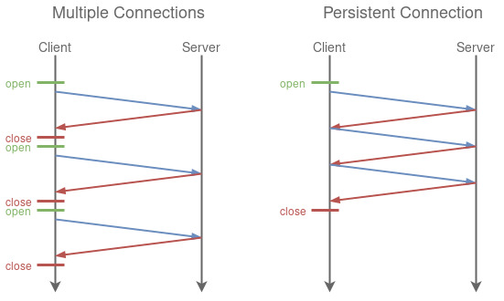

# 介绍一下 Connection:keep-alive

我们知道 HTTP 协议采用“请求-应答”模式，当使用普通模式，即非 KeepAlive 模式时，每个请求/应答客户和服务器都要新建一个连接，完成 之后立即断开连接（HTTP 协议为无连接的协议）；

当使用 Keep-Alive 模式（又称持久连接、连接重用）时，Keep-Alive 功能使客户端到服 务器端的连接持续有效，当出现对服务器的后继请求时，Keep-Alive 功能避免了建立或者重新建立连接。

# 为什么要使用 keep-alive

keep-alive 技术的创建目的，能在多次 HTTP 之前重用同一个 TCP 连接，从而减少创建/关闭多个 TCP 连接的开销（包括响应时间、CPU 资源、减少拥堵等），参考如下示意图（来源：维基百科）：



**客户端如何开启**

- 在 HTTP/1.0 协议中，默认是关闭的，需要在 http 头加入"Connection: Keep-Alive”，才能启用 Keep-Alive；

```js
Connection: keep - alive;
```

- http 1.1 中默认启用 Keep-Alive，如果加入"Connection: close “，才关闭。

```js
Connection: close
```

目前大部分浏览器都是用 http1.1 协议，也就是说默认都会发起 Keep-Alive 的连接请求了，所以是否能完成一个完整的 Keep- Alive 连接就看服务器设置情况。
