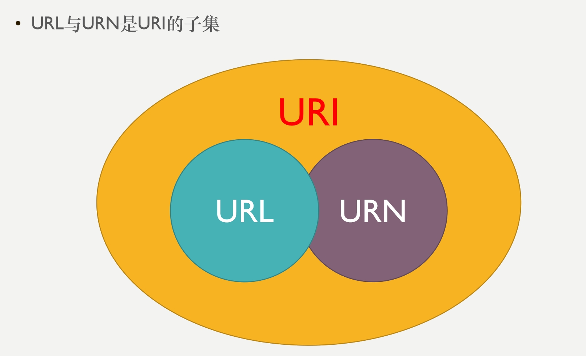

# URI、URL、URN、

- URI：Uniform Resource Identifier，
          即统一资源标识符，用来唯一的标识一个资源。
- URL：Uniform Resource Locator，
          统一资源定位符。URL可以用来标识一个资源，而且还指明了如何定位这个资源
          用地址定义一个资源
- URN：Uniform Resource Name，
          统一资源命名。即通过名字来表示资源的。
          用名称定位一个资源

URL肯定是一个URI，URI并不一定是URL，也有可能是URN

