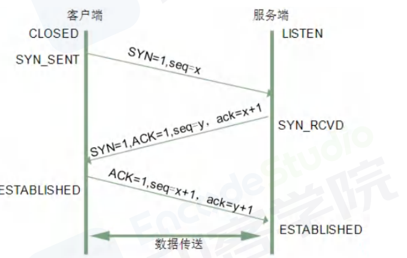
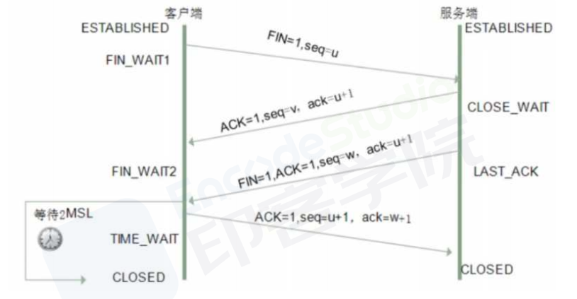
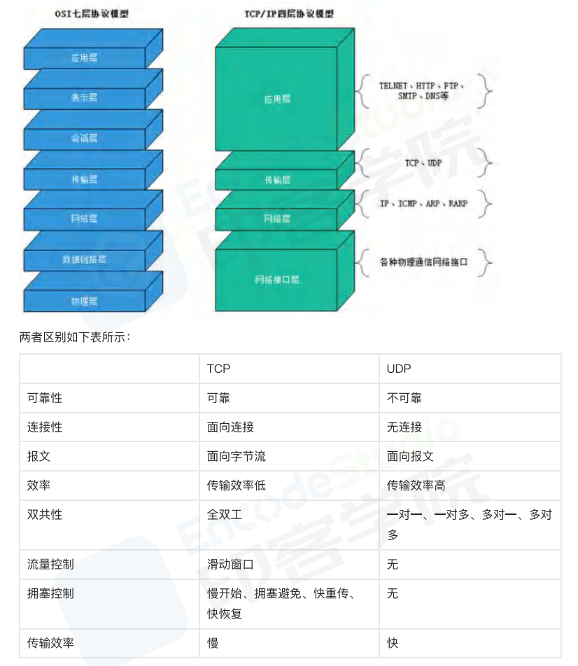

# TCP/IP 协议

TCP/IP，传输控制协议/网际协议，是指能够在多个不同网络间实现信息传输的协议

- TCP(传输控制协议)
  一种面向连接的、可靠的、基于字节流的传输层通信协议

- IP(网际协议)
  
 用于封包交换数据网络的协议

TCP/IP协议不仅仅指的是TCP和IP两个协议，而是指一个由FTP、SMTPTCP、UDP、IP 等协议构成的协议，

只是因为在 TCP/IP 协议中 TCP 协议和IP 协议最具代表性，所以通称为TCP/IP协议族(英语:TCP/IP Protocol Suite，或TCP/IP Protocols)

## TCP/IP 五层体系

- 应用层：应用层、表示层、会话层：HTTP
- 传输层：TCP/UDP
- 网络层：IP
- 数据链路层：数据链路层、物理层
- 物理层

## TCP/IP 四层体系

- 应用层
- 传输层
- 网际互联层
- 网络接口层

# TCP 三次握手

TCP 协议通过三次握手建立可靠的点对点连接，具体过程是：
首先服务器进入监听状态，然后即可处理连接

- 第一次握手：建立连接时，客户端发送 syn 包到服务器，并进入 SYN_SENT 状态，等待服务器确认。在发送的包中还会包含一个初始序列号 seq。此次握手的含义是客户端希望与服务器建立连接。
- 第二次握手：服务器收到 syn 包，然后回应给客户端一个 SYN+ACK 包，此时服务器进入 SYN_RCVD 状态。此次握手的含义是服务端回应客户端，表示已收到并同意客户端的连接请求。
- 第三次握手：客户端收到服务器的 SYN 包后，向服务器再次发送 ACK 包，并进入 ESTAB_LISHED 状态。
- 最后，服务端收到客户端的 ACK 包，于是也进入 ESTAB_LISHED 状态，至此，连接建立完成

## 那为什么要三次握手呢？两次不行吗？

为了确认双方的接收能力和发送能力都正常

如果是用两次握手，则会出现下面这种情况：

两次握手，发送端可以确保自己的发的信息接收端能收到，也能确保接收端发的包自己能收到，但接收端只能确保对方发的包自己能收到，无法确定自己发的包是否能被对方收到。

如客户端发出连接请求，但因连接请求报文丢失而未收到确认，于是客户端再重传一次连接请求。后来收到了确认，建立了连接。数据传输完毕后，就释放了连接，客户端共发出了两个连接请求报文段，其中第一个丢失，第二个到达了服务端，但是第一个丢失的报文段只是在某些网络结点长时间滞留了，延误到连接释放以后的某个时间才到达服务端，此时服务端误认为客户端又发出一次新的连接请求，
于是就向客户端发出确认报文段，同意建立连接，不采用三次握手，只要服务端发出确认，就建立新的连接了，此时客户端忽略服务端发来的确认，也不发送数据，则服务端一致等待客户端发送数据，浪费资源。

# TCP 四次挥手

- Client 向 Server 发送 FIN 包，表示 Client 主动要关闭连接，然后进入 FIN_WAIT_1 状态，等待 Server 返回 ACK 包。此后 Client 不能再向 Server 发送数据，但能读取数据。
- Server 收到 FIN 包后向 Client 发送 ACK 包，然后进入 CLOSE_WAIT 状态，此后 Server 不能再读取数据，但可以继续向 Client 发送数据。
- Client 收到 Server 返回的 ACK 包后进入 FIN_WAIT_2 状态，等待 Server 发送 FIN 包。
- Server 完成数据的发送后，将 FIN 包发送给 Client，然后进入 LAST_ACK 状态，等待 Client 返回 ACK 包，此后 Server 既不能读取数据，也不能发送数据。
- Client 收到 FIN 包后向 Server 发送 ACK 包，然后进入 TIME_WAIT 状态，接着等待足够长的时间（2MSL）以确保 Server 接收到 ACK 包，最后回到 CLOSED 状态，释放网络资源。
- Server 收到 Client 返回的 ACK 包后便回到 CLOSED 状态，释放网络资源

# UDP（User Datagram Protocol）和TCP（Transmission Control Protocol）

## UDP
UDP(User Datagram Protocol)，用户数据包协议，是一个简单的面向数据报的通信协议，即对应用层交下来的报文，不合并，不拆分，
只是在其上面加上首部后就交给了下面的网络层也就是说无论应用层交给 UDP 多长的报文，它统统发送，一次发送一个报文而对接收方，接到后直接去除首部，交给上面的应用层就完成任务

特点如下:

- UDP 不提供复杂的控制机制，利用IP 提供面向无连接的通信服务
- 传输途中出现丢包，UDP 也不负责重发
- 当包的到达顺序出现乱序时，UDP没有纠正的功能。
- 并且它是将应用程序发来的数据在收到的那一刻，立即按照原样发送到网络上的一种机制。即使是出现网络拥堵的情况，UDP 也无法进行流量控制等避免网络拥塞行为

## TCP

TCP(Transmission Control Protocol)，传输控制协议，是一种可靠、面向字节流的通信协议，把上面应用层交下来的数据看成无结构的字节流来发送

可以想象成流水形式的，发送方TCP会将数据放入“蓄水池”(缓存区)，等到可以发送的时候就发送不能发送就等着，TCP会根据当前网络的拥塞状态来确定每个报文段的大小

特点如下

- TCP充分地实现了数据传输时各种控制功能，可以进行丢包时的重发控制，还可以对次序乱掉的分包进行顺序控制。而这些在 UDP 中都没有。
- 此外，TCP 作为一种面向有连接的协议，只有在确认通信对端存在时才会发送数据，从而可以控制通信流量的浪费。
- 根据 TCP 的这些机制，在 IP 这种无连接的网络上也能够实现高可靠性的通信(主要通过检验和序列号、确认应答、重发控制、连接管理以及窗口控制等机制实现)

## 区别

- TCP 是面向连接的协议，建立连接3次握手、断开连接四次挥手，UDP是面向无连接，数据传输前后不连接连接，发送端只负责将数据发送到网络，接收端从消息队列读取
- TCP 提供可靠的服务，传输过程采用流量控制、编号与确认、计时器等手段确保数据无差错，不丢失。
- UDP 则尽可能传递数据，但不保证传递交付给对方
- TCP 面向字节流，将应用层报文看成一串无结构的字节流，分解为多个TCP报文段传输后，在目的站重新装配。UDP协议面向报文，不拆分应用层报文，只保留报文边界，一次发送一个报文，接收方去除报文首部后，原封不动将报文交给上层应用
- TCP 只能点对点全双工通信。UDP 支持一对一、一对多、多对一和多对多的交互通信

