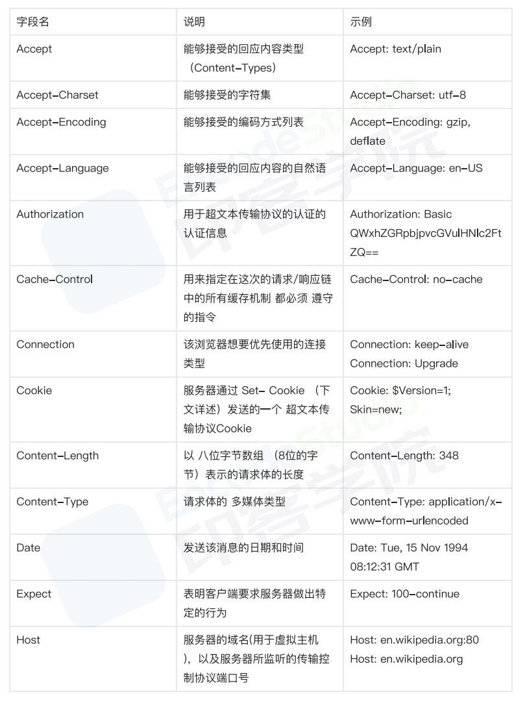

# 介绍

Hyper Text Transfer Protocol，超文本传输协议，是HTTP协议的缩写。

# HTTP 特点

- 「灵活可扩展」。一个是语法上只规定了基本格式，空格分隔单词，换行分隔字段等。另外一个就是传输形式上不仅可以传输文本，还可以传输图片，视频等任意数据。
- 「请求-应答模式」，通常而言，就是一方发送消息，另外一方要接受消息，或者是做出相应等。
- 「可靠传输」，HTTP是基于TCP/IP，因此把这一特性继承了下来。
- 「无状态」，这个分场景回答即可。
 
http协议无状态中的 状态 到底指的是什么？！

【状态】的含义就是：客户端和服务器在某次会话中产生的数据
那么对应的【无状态】就意味着：这些数据不会被保留
通过增加cookie和session机制，现在的网络请求其实是有状态的
在没有状态的http协议下，服务器也一定会保留你每次网络请求对数据的修改，但这跟保留每次访问的数据是不一样的，保留的只是会话产生的结果，而没有保留会话

# HTTP 缺点

1. 「无状态」，有时候，需要保存信息，比如像购物系统，需要保留下顾客信息等等，另外一方面，有时候，无状态也会减少网络开销，比如类似直播行业这样子等，这个还是分场景来说。
2. 「明文传输」，即协议里的报文(主要指的是头部)不使用二进制数据，而是文本形式。这让HTTP的报文信息暴露给了外界，给攻击者带来了便利。
3. 「队头阻塞」，当http开启长连接时，共用一个TCP连接，当某个请求时间过长时，其他的请求只能处于阻塞状态，这就是队头阻塞问题。

队头阻塞有什么解决办法吗👇

并发连接

我们知道对于一个域名而言，是允许分配多个长连接的，那么可以理解成增加了任务队列，也就是说不会导致一个任务阻塞了该任务队列的其他任务，在RFC规范中规定客户端最多并发2个连接，不过实际情况就是要比这个还要多，举个例子，Chrome中是6个。

域名分片

顾名思义，我们可以在一个域名下分出多个二级域名出来，而它们最终指向的还是同一个服务器，这样子的话就可以并发处理的任务队列更多，也更好的解决了队头阻塞的问题。
举个例子，比如TianTian.com，可以分出很多二级域名，比如Day1.TianTian.com，Day2.TianTian.com,Day3.TianTian.com,这样子就可以有效解决队头阻塞问题

# HTTP请求头

# HTTP报文是什么样子的
HTTP 协议的请求报文和响应报文的结构基本相同，由三大部分组成

- 起始行（start line）：描述请求或响应的基本信息；
- 头部字段集合（header）：使用 key-value 形式更详细地说明报文；
- 消息正文（entity）：实际传输的数据，它不一定是纯文本，可以是图片、视频等二进制数据

这其中前两部分起始行和头部字段经常又合称为“请求头”或“响应头”，消息正文又称为“实体”，但与“header”对应，很多时候就直接称为“body”。

# HTTP协议和UDP协议有什么区别

- HTTP是应用层，TCP、UDP是传输层
- TCP有连接（三次握手），有断开（四次挥手），传输稳定
- UDP无连接，无断开不稳定传输，但效率高。如视频会议、语音通话