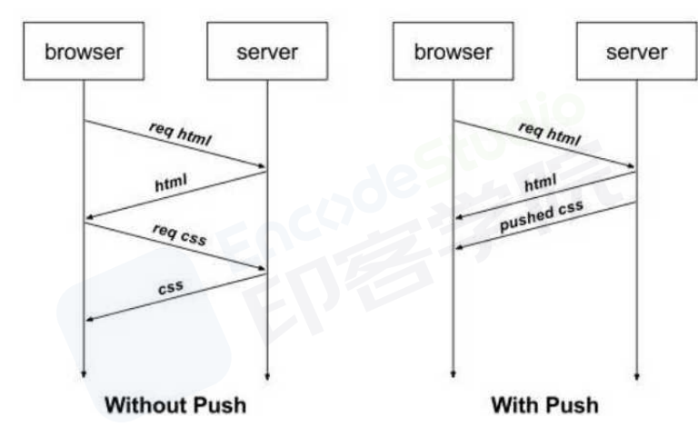

# 介绍下 http1.0、http1.1、http2.0 协议的区别？

## HTTP 0.9

1991 年,原型版本，功能简陋，只有一个命令 GET,只支持纯文本内容，该版本已过时。

## http1.0

- 每次请求和响应完毕后都会销毁 TCP 连接
- 无法复用连接:每次请求都要创建新的 TCP 连接，完成三次握手和四次挥手，网络利用率低
- 队头阻塞:如果前一个请求被某种原因阻塞了，会导致后续请求无法发送
- 任何格式的内容都可以发送，这使得互联网不仅可以传输文字，还能传输图像、视频、二进制等文件。
- 除了 GET 命令，还引入了 POST 命令和 HEAD 命令。
- http 请求和回应的格式改变，除了数据部分，每次通信都必须包括头信息（HTTP header），用来描述一些元数据。
- 只使用 header 中的 If-Modified-Since 和 Expires 作为缓存失效的标准。
- 不支持断点续传，也就是说，每次都会传送全部的页面和数据。
- 通常每台计算机只能绑定一个 IP，所以请求消息中的 URL 并没有传递主机名（hostname）

## http1.1

http1.1 是目前最为主流的 http 协议版本，从 1999 年发布至今，仍是主流的 http 协议版本。

- 长连接

http1.1 允许在请求时增加请求头 connection:keep-alive，这样便允许后续的客户端请求在一段时间内复用之前的 TCP 连接
过程：
客户端请求服务器时，通过请求行告诉服务器使用的协议是 http1.1，同时在请求头中附带 connection:keep-alive（为保持兼容），告诉服务器这是一个长连接，后续请求可以重复使用这一次的 TCP 连接。
这样做的好处是减少了三次握手和四次挥手的次数，一定程度上提升了网络利用率。但由于 http1.1 不支持多路复用，响应顺序必须按照请求顺序抵达客户端，不能真正实现并行传输，因此在 http2.0 出现之前，实际项目中往往把静态资源，比如图片，分发到不同域名下的资源服务器，以便实现真正的并行传输

- 引入了持久连接（ persistent connection），即 TCP 连接默认不关闭，可以被多个请求复用，不用声明 Connection: keep-alive。长连接的连接时长可以通过请求头中的 keep-alive 来设置
- 管道化

引入了管道机制（ pipelining），即在同一个 TCP 连接里，客户端可以同时发送多个 请求，进一步改进了 HTTP 协议的效率。

- 缓存处理

HTTP 1.1 中新增加了 E-tag，If-Unmodified-Since, If-Match, If-None-Match 等缓存控制标头来控制缓存失效。

- 断点传输

在上传/下载资源时，如果资源过大，将其分割为多个部分，分别上传/下载，如果遇到网络故障，可以从已经上传/下载好的地方继续请求，不用从头开始，提高效率,通过使用请求头中的 Range 来实现。

- 使用了虚拟网络，在一台物理服务器上可以存在多个虚拟主机（Multi-homed Web Servers），并且它们共享一个 IP 地址。

- 新增方法：PUT、 PATCH、 OPTIONS、 DELETE。

## http1.x 版本问题

- 在传输数据过程中，所有内容都是明文，客户端和服务器端都无法验证对方的身份，无法保证数据的安全性。
- HTTP/1.1 版本默认允许复用 TCP 连接，但是在同一个 TCP 连接里，所有数据通信是按次序进行的，服务器通常在处理完一个回应后，才会继续去处理下一个，这样子就会造成队头阻塞。
- http/1.x 版本支持 Keep-alive，用此方案来弥补创建多次连接产生的延迟，但是同样会给服务器带来压力，并且的话，对于单文件被不断请求的服务，Keep-alive 会极大影响性能，因为它在文件被请求之后还保持了不必要的连接很长时间。

## http2.0

1.  二进制分帧

- 二进制分帧 这是一次彻底的二进制协议，头信息和数据体都是二进制，并且统称为"帧"：头信息帧和数据帧。

- 之前是明文传输，不方便计算机解析，对于回车换行符来说到底是内容还是分隔符，都需要内部状态机去识别，这样子效率低，HTTP/2采用二进制格式，全部传输01串，便于机器解码。

- 这样子一个报文格式就被拆分为一个个二进制帧，用「Headers帧」存放头部字段，「Data帧」存放请求体数据。这样子的话，就是一堆乱序的二进制帧，它们不存在先后关系，因此不需要排队等待，解决了HTTP队头阻塞问题。

- 在客户端与服务器之间，双方都可以互相发送二进制帧，这样子「双向传输的序列」，称为流，所以HTTP/2中以流来表示一个TCP连接上进行多个数据帧的通信，这就是多路复用概念。

- 那乱序的二进制帧，是如何组装成对于的报文呢？

  所谓的乱序，值的是不同ID的Stream是乱序的，对于同一个Stream ID的帧是按顺序传输的。

  接收方收到二进制帧后，将相同的Stream ID组装成完整的请求报文和响应报文。
  
  二进制帧中有一些字段，控制着优先级和流量控制等功能，这样子的话，就可以设置数据帧的优先级，让服务器处理重要资源，优化用户体验。

2.  多路复用

基于二进制分帧，在同一域名下所有访问都是从同一个 tcp 连接中走，并且不再有队头阻塞问题，也无须遵守响应顺序

HTTP 1.x 中，如果想并发多个请求，必须使用多个 TCP 链接，且浏览器为了控制资源，还会对单个域名有 6-8 个的 TCP 链接请求限制。

HTTP2 中：

- 同域名下所有通信都在单个连接上完成。
- 单个连接可以承载任意数量的双向数据流。
- 数据流以消息的形式发送，而消息又由一个或多个帧组成，多个帧之间可以乱序发送，因为根据帧首部的流标识可以重新组装，也就是 Stream ID，流标识符，有了它，接收方就能从乱序的二进制帧中选择 ID 相同的帧，按照顺序组装成请求/响应报文。

在 HTTP/2 中，有两个非常重要的概念，分别是帧（frame）和流（stream）。 帧代表着最小的数据单位，每个帧会标识出该帧属于哪个流，流也就是多个帧组成的数据流。 多路复用，就是在一个 TCP 连接中可以存在多条流。换句话说，也就是可以发送多个请求，对端可以通过帧中的标识知道属于哪个请求。通过这个技术，可以避免 HTTP 旧版本中的队头阻塞问题，极大的提高传输性能。

3.  头部压缩

HTTP 1.1 版本会出现 「User-Agent、Cookie、Accept、Server、Range」 等字段可能会占用几百甚至几千字节，而 Body 却经常只有几十字节，所以导致头部偏重。

HTTP 2.0 使用 HPACK 算法进行压缩。


```
从上面看，我们可以看到类似于索引表，每个索引表对应一个值，比如索引为2对应头部中的method头部信息，这样子的话，在传输的时候，不在是传输对应的头部信息了，而是传递索引，对于之前出现过的头部信息，只需要把「索引」(比如1，2，...)传给对方即可，对方拿到索引查表就行了。
```

这种「传索引」的方式，可以说让请求头字段得到极大程度的精简和复用。
其次是对于整数和字符串进行「哈夫曼编码」，哈夫曼编码的原理就是先将所有出现的字符建立一张索引表，然后让出现次数多的字符对应的索引尽可能短，传输的时候也是传输这样的「索引序列」，可以达到非常高的压缩率。

4. 服务器推送

http2.0 允许服务器直接推送消息给客户端，无须客户端明确的请求

浏览器发送一个请求，服务器主动向浏览器推送与这个请求相关的资源，这样浏览器就不用发起后续请求。



相比较 http/1.1 的优势 👇

- 推送资源可以由不同页面共享
- 服务器可以按照优先级推送资源
- 客户端可以缓存推送的资源
- 客户端可以拒收推送过来的资源

5. 请求优先级
   可以设置数据帧的优先级，让服务端先处理重要资源，优化用户体验。

## http3.0

http3.0 它完全抛弃了 TCP 协议，转而使用 UDP 协议，是为了进一步提升性能。 虽然 http2.0 进行了大量的优化，但它无法摆脱 TCP 协议本身的问题，比如建立连接时间长、对头阻塞问题等等。为了保证传输的可靠性，http3.0 使用了 QUIC 协议。


1.流量控制、传输可靠性功能：QUIC 在 UDP 的基础上增加了一层来保证数据传输可靠性，它提供了数据包重传、拥塞控制、以及其他一
些 TCP 中的特性。

2.集成 TLS 加密功能：目前 QUIC 使用 TLS1.3，减少了握手所花费的RTT 数。

3.多路复用：同一物理连接上可以有多个独立的逻辑数据流，实现了数据流的单独传输，解决了 TCP 的队头阻塞问题。

4.快速握手：由于基于 UDP，可以实现使用 0 ~ 1 个 RTT 来建立连接。
