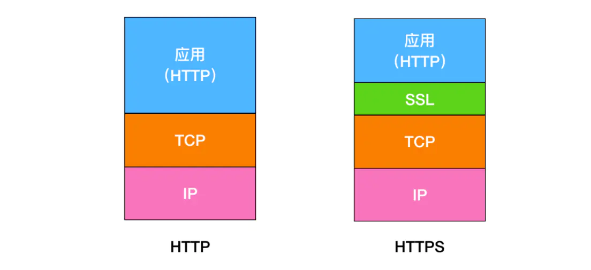
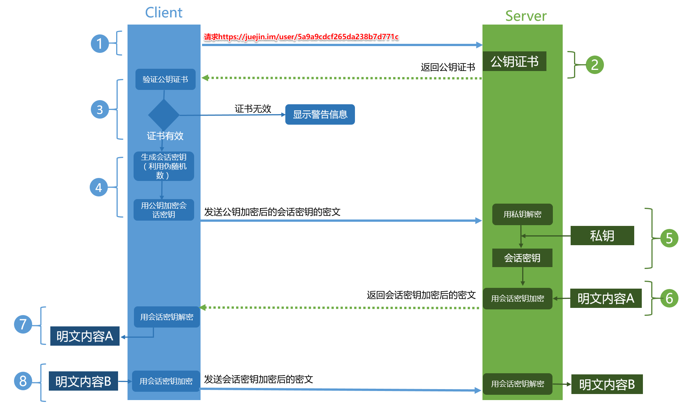
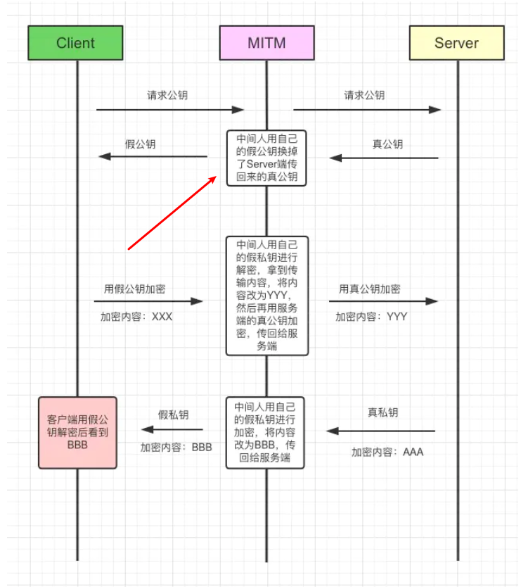
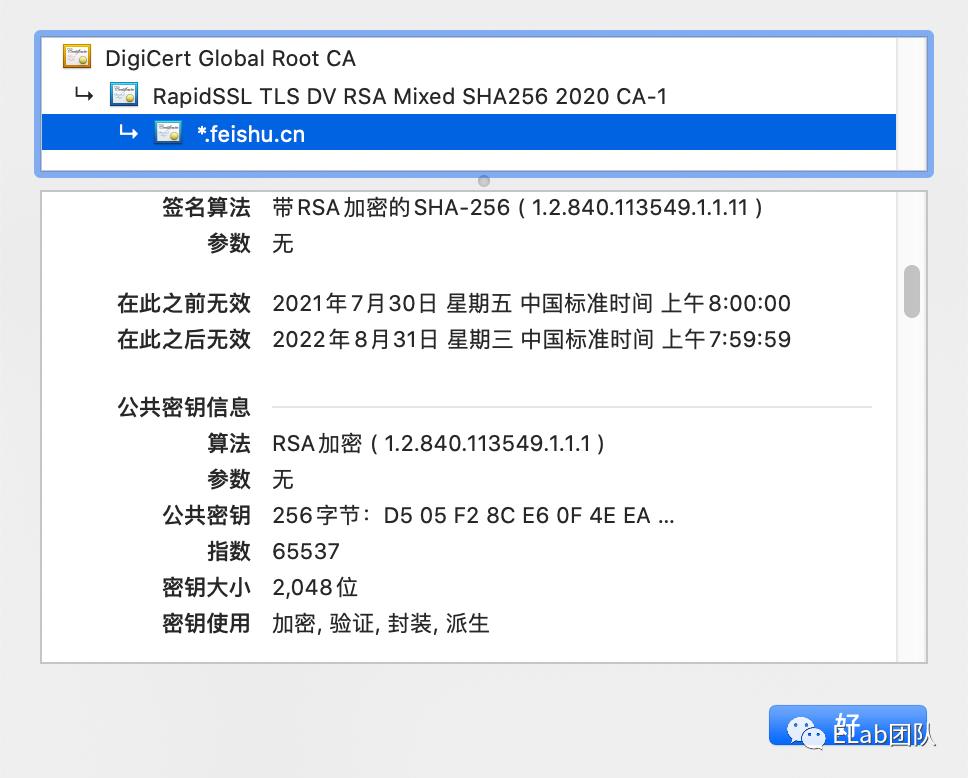
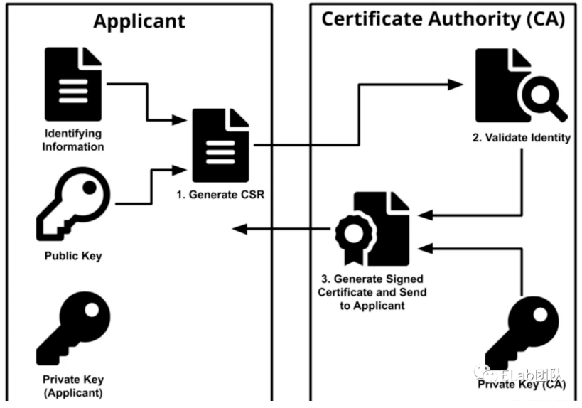
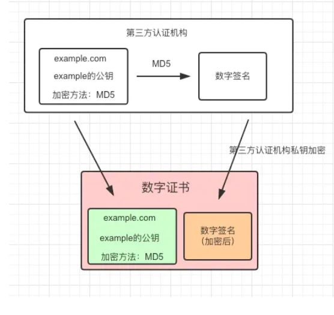
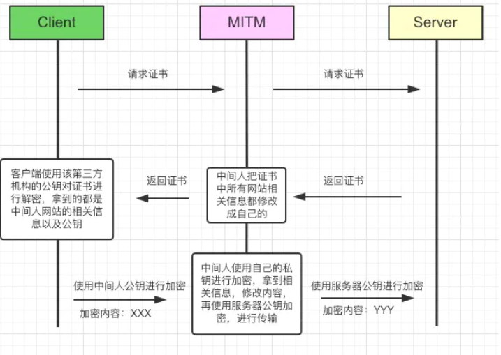

# https 与 http 的区别?

HTTPS 要比 HTTPS 多了 secure 安全性这个概念，实际上， HTTPS 并不是一个新的应用层协议，它其实就是 HTTP + TLS/SSL 协议组合而成，而安全性的保证正是 SSL/TLS 所做的工作。

**「SSL」**
安全套接层（Secure Sockets Layer）

**「TLS」**
（传输层安全，Transport Layer Security）

现在主流的版本是 TLS/1.2, 之前的 TLS1.0、TLS1.1 都被认为是不安全的，在不久的将来会被完全淘汰。

**「HTTPS 就是身披了一层 SSL 的 HTTP」。**

- 那么区别有哪些呢 👇

1.  HTTP 是明文传输协议，HTTPS 协议是由 SSL+HTTP 协议构建的可进行加密传输、身份认证的网络协议，比 HTTP 协议安全。

2.  HTTPS 比 HTTP 更加安全，对搜索引擎更友好，利于 SEO,谷歌、百度优先索引 HTTPS 网页。

3.  HTTPS 标准端口 443，HTTP 标准端口 80。

4.  HTTPS 需要用到 SSL 证书，而 HTTP 不用。

# 介绍一个 HTTPS 工作原理

- 我们可以把 HTTPS 理解成「HTTPS = HTTP + SSL/TLS」

- TLS/SSL 的功能实现主要依赖于三类基本算法：**散列函数** 、**对称加密**和**非对称加密**，其利用非对称加密实现身份认证和密钥协商，对称加密算法采用协商的密钥对数据加密，基于散列函数验证信息的完整性。

## 对称加密

加密和解密用同一个秘钥的加密方式叫做对称加密。Client 客户端和 Server 端共用一套密钥，这样子的加密过程似乎很让人理解，但是随之会产生一些问题。

- 「问题一:」 WWW 万维网有许许多多的客户端，不可能都用秘钥 A 进行信息加密，这样子很不合理，所以解决办法就是使用一个客户端使用一个密钥进行加密。

- 「问题二:「既然不同的客户端使用不同的密钥，那么」对称加密的密钥如何传输？」 那么解决的办法只能是「一端生成一个秘钥，然后通过 HTTP 传输给另一端」，那么这样子又会产生新的问题。
-
- 「问题三:」 这个传输密钥的过程，又如何保证加密？「如果被中间人拦截，密钥也会被获取,」 那么你会说对密钥再进行加密，那又怎么保存对密钥加密的过程，是加密的过程？
- 到这里，我们似乎想明白了，使用对称加密的方式，行不通，所以我们需要采用非对称加密 👇

## 非对称加密

通过上面的分析，对称加密的方式行不通，那么我们来梳理一下非对称加密。采用的算法是 RSA，所以在一些文章中也会看见「传统 RSA 握手」，基于现在 TLS 主流版本是 1.2，所以接下来梳理的是「TLS/1.2 握手过程」

非对称加密中，我们需要明确的点是 👇

1.  有一对秘钥，「公钥」和「私钥」。
2.  公钥加密的内容，只有私钥可以解开，私钥加密的内容，所有的公钥都可以解开，这里说的「公钥都可以解开，指的是一对秘钥」。
3.  公钥可以发送给所有的客户端，私钥只保存在服务器端

## RSA 算法（最典型的非对称加密算法）

- 想要彻底搞懂 RSA，需要了解数论的知识，全部推导过程 RSA 加密算法[2]。本文简单介绍思路：使用两个超大质数以及其乘积作为生成公钥和私钥的材料，想要从公钥推算出私钥是非常困难的（需要对超大数因式分解为两个很大质数的乘积）。目前被破解的最长 RSA 密钥是 768 个二进制位。也就是说，长度超过 768 位的密钥，还无法破解（至少没人公开宣布）。因此可以认为，1024 位的 RSA 密钥基本安全，2048 位的密钥极其安全。

- 优点：强度高、安全性强于对称加密算法、无需传递私钥导致没有密钥泄露风险
- 缺点：计算量大、速度慢
- 适用场景：
  1. 适用于需要密钥交换的场景，如互联网应用，无法事先约定密钥。可以与对称加密算法结合：
  2. 利用非对称加密算法安全性较好的特点来传递对称加密算法的密钥。
  3. 利用对称加密算法加解密速度快的特点，进行数据内容比较大的加密场景的加密。如 HTTPS。

## 主要工作流程

梳理起来，可以把 **「TLS 1.2 握手过程」** 分为主要的五步 👇

1. Client 发起一个 HTTPS 请求，连接 443 端口。这个过程可以理解成是「请求公钥的过程」。

2. Server 端收到请求后，通过第三方机构私钥加密，会把数字证书（也可以认为是公钥证书）发送给 Client。

3.

- 浏览器安装后会自动带一些权威第三方机构公钥，使用匹配的公钥对数字签名进行解密。
- 根据签名生成的规则对网站信息进行本地签名生成，然后两者比对。
- 通过比对两者签名，匹配则说明认证通过，不匹配则获取证书失败。

4. 在安全拿到「服务器公钥」后，客户端 Client 随机生成一个「对称密钥」，使用「服务器公钥」（证书的公钥）加密这个「对称密钥」，发送给 Server(服务器)。

5. Server(服务器)通过自己的私钥，对信息解密，至此得到了「对称密钥」，此时两者都拥有了相同的「对称密钥」。

接下来，就可以通过该对称密钥对传输的信息加密/解密啦，从上面图举个例子 👇

- Client 用户使用该「对称密钥」加密'明文内容 B',发送给 Server(服务器)
- Server 使用该「对称密钥」进行解密消息，得到明文内容 B。

接下来考虑一个问题，**「如果公钥被中间人拿到纂改怎么办呢？」**

**「客户端可能拿到的公钥是假的，解决办法是什么呢？」**

# 第三方认证

客户端无法识别传回公钥是中间人的，还是服务器的，这是问题的根本，我们是不是可以通过某种规范可以让客户端和服务器都遵循某种约定呢？

那就是通过 **「第三方认证的方式」**
在 HTTPS 中，通过 **「证书」** + **「数字签名」** 来解决这个问题。

## 先介绍数字证书
引出一个概念叫CA
CA就是 Certificate Authority，颁发数字证书的机构。作为受信任的第三方，CA承担公钥体系中公钥的合法性检验的责任。证书就是源服务器向可信任的第三方机构申请的数据文件。这个证书除了表明这个域名是属于谁的，颁发日期等，还包括了第三方证书的私钥。服务器将公钥放在数字证书中，只要证书是可信的，公钥就是可信的。下图是飞书域名的证书中部分内容的信息👇

## 数字签名

 - 摘要算法一般用哈希函数来实现，可以理解成一种定长的压缩算法，它能把任意长度的数据压缩到固定长度。这好比是给数据加了一把锁，对数据有任何微小的改动都会使摘要变得截然不同。

 - 通常情况下，数字证书的申请人（服务器）将生成由私钥和公钥以及证书请求文件（Certificate Signing Request，CSR）组成的密钥对。CSR是一个编码的文本文件，其中包含公钥和其他将包含在证书中的信息（例如域名，组织，电子邮件地址等）。密钥对和CSR生成通常在将要安装证书的服务器上完成，并且 CSR 中包含的信息类型取决于证书的验证级别。与公钥不同，申请人的私钥是安全的，永远不要向 CA（或其他任何人）展示。

 - 生成 CSR 后，申请人将其发送给 CA，CA 会验证其包含的信息是否正确，如果正确，则使用颁发的私钥对证书进行数字签名，然后将签名放在证书内随证书一起发送给申请人。

- 在SSL握手阶段，浏览器在收到服务器的证书后，使用CA的公钥进行解密，取出证书中的数据、数字签名以及服务器的公钥。如果解密成功，则可验证服务器身份真实。之后浏览器再对数据做Hash运算，将结果与数字签名作对比，如果一致则可以认为内容没有收到篡改

- 对称加密和非对称加密是公钥加密，私钥解密， 而数字签名正好相反，是私钥加密（签名），公钥解密（验证）

这里唯一不同的是，假设对网站信息加密的算法是MD5，通过MD5加密后，**「然后通过第三方机构的私钥再次对其加密，生成数字签名」**

这样子的话，数字证书包含有两个特别重要的信息👉 **「某网站公钥+数字签名」**

我们再次假设中间人截取到服务器的公钥后，去替换成自己的公钥，因为有数字签名的存在，这样子客户端验证发现数字签名不匹配，这样子就防止中间人替换公钥的问题。

那么客户端是如何去对比两者数字签名的呢？

- 浏览器会去安装一些比较权威的第三方认证机构的公钥，比如VeriSign、Symantec以及GlobalSign等等。
- 
- 验证数字签名的时候，会直接从本地拿到相应的第三方的公钥，对私钥加密后的数字签名进行解密得到真正的签名。
- 
- 然后客户端利用签名生成规则进行签名生成，看两个签名是否匹配，如果匹配认证通过，不匹配则获取证书失败。

## 数字签名作用

数字签名：将网站的信息，通过特定的算法加密，比如MD5,加密之后，再通过服务器的私钥进行加密，形成 **「加密后的数字签名」**

第三方认证机构是一个公开的平台，中间人可以去获取。
如果没有数字签名的话，这样子可以就会有下面情况👇

从上面我们知道，如果 **「只是对网站信息进行第三方机构私钥加密」**的话，还是会受到欺骗。
因为没有认证，所以中间人也向第三方认证机构进行申请，然后拦截后把所有的信息都替换成自己的，客户端仍然可以解密，并且无法判断这是服务器的还是中间人的，最后造成数据泄露。

## 「总结」 
- HTTPS就是使用SSL/TLS协议进行加密传输
  
- 大致流程：客户端拿到服务器的公钥（是正确的），然后客户端随机生成一个 **「对称加密的秘钥」**，使用 **「该公钥」** 加密，传输给服务端，服务端再通过解密拿到该 **「对称秘钥」**，后续的所有信息都通过该 **「对称秘钥」** 进行加密解密，完成整个HTTPS的流程。
  
 - **「第三方认证」**，最重要的是 **「数字签名」**，避免了获取的公钥是中间人的。

# 介绍 HTTPS 握手过程

- 客户端请求服务器，并告诉服务器自身支持的加密算法以及密钥长度等信息
- 服务器响应公钥和服务器证书
- 客户端验证证书是否合法，然后生成一个会话密钥，并用服务器的公钥加密密钥，把加密的结果通过请求发送给服务器
- 服务器使用私钥解密被加密的会话密钥并保存起来，然后使用会话密钥加密消息响应给客户端，表示自己已经准备就绪
- 客户端使用会话密钥解密消息，知道了服务器已经准备就绪。
- 后续客户端和服务器使用会话密钥加密信息传递消息

# 介绍 SSL 和 TLS

它们都是用于保证传输安全的协议，介于传输层和应用层之间，TLS 是 SSL 的升级版。
它们的基本流程一致：

客户端向服务器端索要公钥，并使用数字证书验证公钥。
客户端使用公钥加密会话密钥，服务端用私钥解密会话密钥，于是得到一个双方都认可的会话密钥
传输的数据使用会话密钥加密，然后再传输，接收消息方使用会话密钥解密得到原始数据

# 介绍下 HTTPS 中间人攻击

针对 HTTPS 攻击主要有 SSL 劫持攻击和 SSL 剥离攻击两种。

- SSL 劫持攻击是指攻击者劫持了客户端和服务器之间的连接，将服务器的合法证书替换为伪造的证书，从而获取客户端和服务器之间传递的信息。这种方式一般容易被用户发现，浏览器会明确的提示证书错误，但某些用户安全意识不强，可能会点击继续浏览，从而达到攻击目的。

- SSL 剥离攻击是指攻击者劫持了客户端和服务器之间的连接，攻击者保持自己和服务器之间的 HTTPS 连接，但发送给客户端普通的 HTTP 连接，由于 HTTP 连接是明文传输的，即可获取客户端传输的所有明文数据。

# HTTPS 握手过程中，客户端如何验证证书的合法性

1. 首先浏览器读取证书中的证书所有者、有效期等信息进行校验，校验证书的网站域名是否与证书颁发的域名一致，校验证书是否在有效期内；
2. 浏览器开始查找操作系统中已内置的受新人的证书发布机构 CA，与服务器发来的证书中的颁发者 CA 比对，用于校验证书是否为合法机构颁发；
3. 如果找不到，浏览器就会报错，说明浏览器发来的证书是不可信任的；
4. 如果找到，那么浏览器就会从操作系统中取出颁发者 CA 的公钥（多数浏览器开发商发布版本时，会实现在内部植入常用认证机关的公开密钥），然后对服务器发来的证书里面的签名进行解密；
5. 浏览器使用相同的 hash 算法计算出服务器发来的证书的 hash 值，将这个计算的 hash 值与证书中签名做迪比；
6. 对比结果一致，则证明服务器发来的证书合法，没有被冒充

# TLS 的握手过程

TLS 的握手过程可以简单分为两个过程：客户端拿到服务端的 CA 证书，验证其有效性得到了服务端的公钥；客户端和服务端分别生成同样的密钥，之后用生成的密钥加密通信。

1. 客户端向服务器发出加密通信的请求，并携带随机数 i
2. 服务端回应，发送服务端 CA 证书给客户端，并携带随机数 j
3. 客户端校验 CA 证书，得到服务端的公钥
4. 客户端用服务端的公钥加密一个随机数 k，发送
5. 客户端和服务端分别用 ijk 三个随机数生成相同的密钥（对称密钥）
6. 服务端发送握手完毕的消息，之后使用对称密钥加密通信

# SSL 连接断开后如何恢复？

## Session ID
每一次的会话都有一个编号，当对话中断后，下一次重新连接时，只要客户端给出这个编号，服务器如果有这个编号的记录，那么双方就可以继续使用以前的密
钥，而不用重新生成一把。

## Session Ticket
session ticket 是服务器在上一次对话中发送给客户的，这个 ticket 是加密的，只有服务器可能够解密，里面包含了本次会话的信息，比如对话密钥和加密方法
等。这样不管我们的请求是否转移到其他的服务器上，当服务器将 ticket 解密以后，就能够获取上次对话的信息，就不用重新生成对话秘钥了。
