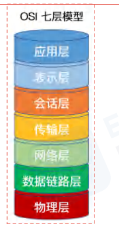

# 网络的五层模型
从上到下分别为：应用层、传输层、网络层、数据链路层、物理层。在发送消息时，消息从上到下进行打包，每一层会在上一层基础上加包，而接受消息时，从下到上进行解包，最终得到原始信息。
其中：

- 应用层主要面向互联网中的应用场景，比如网页、邮件、文件中心等等，它的代表协议有 http、smtp、pop3、ftp、DNS 等等

- 传输层主要面向传输过程，比如 TCP 协议是为了保证可靠的传输，而 UDP 协议则是一种无连接的广播，它们提供了不同的传输方式

- 网络层主要解决如何定位目标的问题，比如 IP、ICMP、ARP 等等

- 数据链路层的作用是将数据可靠的传输到目标，比如常见的以太网协议、P2P 协议

- 物理层是要规范网络两端使用的物理设备，比如蓝牙、wifi、光纤、网线接头等

# OSI七层模型和TCP/IP四层模型

- 应用层

 OSI 参考模型中最靠近用户的一层，是为计算机用户提供应用接口，也为用户直接提供各种网络服务。我们常见应用层的网络服务协议有：
HTTP，HTTPS，FTP，POP3、SMTP 等。在客户端与服务器中经常会有数据的请求，这个时候就是会用到http(hyper text transfer protocol)(超文本传输协议)或者 https. 在后端设计数据接口时，我们常常使用到这个协议。

FTP 是文件传输协议，在开发过程中，个人并没有涉及到，但是我想，在一些资源网站，比如百度网盘``迅雷应该是基于此协议的。
SMTP 是 simple mail transfer protocol（简单邮件传输协议）。在一个项目中，在用户邮箱验证码登录的功能时，使用到了这个协议。

- 表示层

表示层提供各种用于应用层数据的编码和转换功能,确保一个系统的应用层发送的数据能被另一个系统的应用层识别。如果必要，该层可
提供一种标准表示形式，用于将计算机内部的多种数据格式转换成通信中采用的标准表示形式。数据压缩和加密也是表示层可提供的转换
功能之一。

在项目开发中，为了方便数据传输，可以使用 base64 对数据进行编解码。如果按功能来划分，base64 应该是工作在表示层。

- 会话层

会话层就是负责建立、管理和终止表示层实体之间的通信会话。该层的通信由不同设备中的应用程序之间的服务请求和响应组成。

- 传输层

传输层建立了主机端到端的链接，传输层的作用是为上层协议提供端到端的可靠和透明的数据传输服务，包括处理差错控制和流量控制等
问题。该层向高层屏蔽了下层数据通信的细节，使高层用户看到的只是在两个传输实体间的一条主机到主机的、可由用户控制和设定的、
可靠的数据通路。我们通常说的，TCP UDP 就是在这一层。端口号既是这里的“端”。

- 网络层

本层通过 IP 寻址来建立两个节点之间的连接，为源端的运输层送来的分组，选择合适的路由和交换节点，正确无误地按照地址传送给目
的端的运输层。就是通常说的 IP 层。这一层就是我们经常说的 IP 协议层。IP 协议是 Internet 的基础。我们可以这样理解，网络层规定
了数据包的传输路线，而传输层则规定了数据包的传输方式。

- 数据链路层

将比特组合成字节,再将字节组合成帧,使用链路层地址 (以太网使用 MAC 地址)来访问介质,并进行差错检测。
网络层与数据链路层的对比，通过上面的描述，我们或许可以这样理解，网络层是规划了数据包的传输路线，而数据链路层就是传输路线。
不过，在数据链路层上还增加了差错控制的功能。

- 物理层

实际最终信号的传输是通过物理层实现的。通过物理介质传输比特流。规定了电平、速度和电缆针脚。常用设备有（各种物理设备）集线器、
中继器、调制解调器、网线、双绞线、同轴电缆。这些都是物理层的传输介质。
  
TCP/IP 四层概念：
- 应用层：应用层、表示层、会话层：HTTP
- 传输层：传输层：TCP/UDP
- 网络层：网络层：IP
- 数据链路层：数据链路层、物理层

# GET 和 POST 的区别

浏览器在发送 GET 请求时，不会附带请求体
- GET 请求的传递信息量有限，适合传递少量数据；POST 请求的传递信息量是没有限制的，适合传输大量数据。
- GET 请求只能传递 ASCII 数据，遇到非 ASCII 数据需要进行编码；POST 请求没有限制
- 大部分 GET 请求传递的数据都附带在 path 参数中，能够通过分享地址完整的重现页面，但同时也暴露了数据，若有敏感数据传递，不应该使用 GET 请求，至少不应该放到 path 中
- 刷新页面时，若当前的页面是通过 POST 请求得到的，则浏览器会提示用户是否重新提交。若是 GET 请求得到的页面则没有提示。
- GET 请求的地址可以被保存为浏览器书签，POST 不可以

# webSocket 协议是什么，能简述一下吗？

websocket 协议 HTML5 带来的新协议，相对于 http，它是一个持久连接的协议，它利用 http 协议完成握手，然后通过 TCP 连接通道发送消息，使用 websocket 协议可以实现服务器主动推送消息。
首先，客户端若要发起 websocket 连接，首先必须向服务器发送 http 请求以完成握手，请求行中的 path 需要使用ws:开头的地址，请求头中要分别加入upgrade、connection、Sec-WebSocket-Key、Sec-WebSocket-Version标记
然后，服务器收到请求后，发现这是一个 websocket 协议的握手请求，于是响应行中包含Switching Protocols，同时响应头中包含upgrade、connection、Sec-WebSocket-Accept标记
当客户端收到响应后即可完成握手，随后使用建立的 TCP 连接直接发送和接收消息。

# webSocket 与传统的 http 有什么优势

当页面中需要观察实时数据的变化（比如聊天、k 线图）时，过去我们往往使用两种方式完成:
第一种是短轮询，即客户端每隔一段时间就向服务器发送消息，询问有没有新的数据
第二种是长轮询，发起一次请求询问服务器，服务器可以将该请求挂起，等到有新消息时再进行响应。响应后，客户端立即又发起一次请求，重复整个流程。
无论是哪一种方式，都暴露了 http 协议的弱点，即响应必须在请求之后发生，服务器是被动的，无法主动推送消息。而让客户端不断的发起请求又白白的占用了资源。
websocket 的出现就是为了解决这个问题，它利用 http 协议完成握手之后，就可以与服务器建立持久的连接，服务器可以在任何需要的时候，主动推送消息给客户端，这样占用的资源最少，同时实时性也最高

# 短轮询、长轮询和 WebSocket 间的区别？
## 短轮询
短轮询的基本思路:
浏览器每隔一段时间向浏览器发送 http 请求，服务器端在收到请求后，不论是否有数据更新，都直接进行 响应。
这种方式实现的即时通信，本质上还是浏览器发送请求，服务器接受请求的一个过程，通过让客户端不断的进行请求，使得客户端能够模拟实时地收到服务器端的数据的变化。
### 优缺点👇
优点是比较简单，易于理解。
缺点是这种方式由于需要不断的建立 http 连接，严重浪费了服务器端和客户端的资源。当用户增加时，服务器端的压力就会变大，这是很不合理的。 
## 长轮询
长轮询的基本思路:
首先由客户端向服务器发起请求，当服务器收到客户端发来的请求后，服务器端不会直接进行响应，而是先将 这个请求挂起，然后判断服务器端数据是否有更新。
如果有更新，则进行响应，如果一直没有数据，则到达一定的时间限制才返回。客户端 JavaScript 响应处理函数会在处理完服务器返回的信息后，再次发出请求，重新建立连接。
### 优缺点👇
长轮询和短轮询比起来，它的优点是「明显减少了很多不必要的 http 请求次数」，相比之下节约了资源。
长轮询的缺点在于，连接挂起也会导致资源的浪费。
## WebSocket
WebSocket 是 Html5 定义的一个新协议，与传统的 http 协议不同，该协议允许由服务器主动的向客户端推送信息。
使用 WebSocket 协议的缺点是在服务器端的配置比较复杂。WebSocket 是一个全双工的协议，也就是通信双方是平等的，可以相互发送消息。

