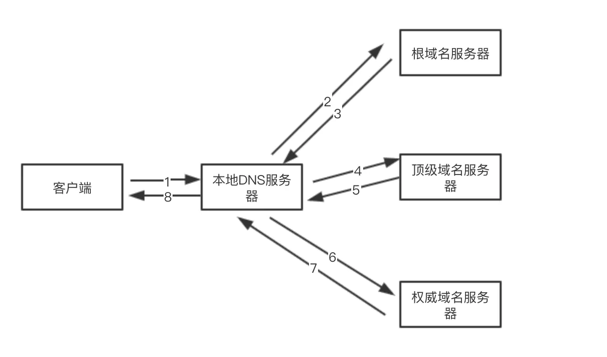

# DNS如何工作的

DNS 协议提供的是一种主机名到 IP 地址的转换服务，就是我们常说的域名系统。是应用层协议，通常该协议运行在UDP协议之上，使用的是53端口号。

「我们通过一张图来看看它的查询过程吧」👇

这张图很生动的展示了DNS在本地DNS服务器是如何查询的，「一般向本地DNS服务器发送请求是递归查询的」

本地 DNS 服务器向其他域名服务器请求的过程是迭代查询的过程👇

# 递归查询和迭代查询

1. 递归查询指的是查询请求发出后，域名服务器代为向下一级域名服务器发出请求，最后向用户返回查询的最终结果。使用递归 查询，用户只需要发出一次查询请求。

2. 迭代查询指的是查询请求后，域名服务器返回单次查询的结果。下一级的查询由用户自己请求。使用迭代查询，用户需要发出 多次的查询请求。

3. 所以一般而言，「本地服务器查询是递归查询」，而「本地 DNS 服务器向其他域名服务器请求的过程是迭代查询的过程」。

# DNS缓存

缓存也很好理解，在一个请求中，当某个DNS服务器收到一个DNS回答后，它能够回答中的信息缓存在本地存储器中。「返回的资源记录中的 TTL 代表了该条记录的缓存的时间。」

# DNS实现负载平衡

它是如何实现负载均衡的呢？首先我们得清楚DNS 是可以用于在冗余的服务器上实现负载平衡。

**原因：** 这是因为一般的大型网站使用多台服务器提供服务，因此一个域名可能会对应 多个服务器地址。

举个例子来说👇

 - 当用户发起网站域名的 DNS 请求的时候，DNS 服务器返回这个域名所对应的服务器 IP 地址的集合
 - 在每个回答中，会循环这些 IP 地址的顺序，用户一般会选择排在前面的地址发送请求。
 - 以此将用户的请求均衡的分配到各个不同的服务器上，这样来实现负载均衡。

# 总结

1. DNS域名系统，是应用层协议，运行UDP协议之上，使用端口43。

2. 查询过程，本地查询是递归查询，依次通过浏览器缓存 —>> 本地hosts文件 —>> 本地DNS解析器 —>>本地DNS服务器 —>> 其他域名服务器请求。 接下来的过程就是迭代过程。

3. 递归查询一般而言，发送一次请求就够，迭代过程需要用户发送多次请求。

# DNS 为什么使用 UDP 协议作为传输层协议？

**「DNS 使用 UDP 协议作为传输层协议的主要原因是为了避免使用 TCP 协议时造成的连接时延。」** 

- 为了得到一个域名的 IP 地址，往往会向多个域名服务器查询，如果使用 TCP 协议，那么每次请求都会存在连接时延，这样使 DNS 服务变得很慢。

- 大多数的地址查询请求，都是浏览器请求页面时发出的，这样会造成网页的等待时间过长。