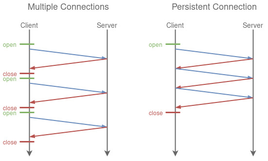

# 介绍一下Connection:keep-alive

我们知道HTTP协议采用“请求-应答”模式，当使用普通模式，即非KeepAlive模式时，每个请求/应答客户和服务器都要新建一个连接，完成 之后立即断开连接（HTTP协议为无连接的协议）；

当使用Keep-Alive模式（又称持久连接、连接重用）时，Keep-Alive功能使客户端到服 务器端的连接持续有效，当出现对服务器的后继请求时，Keep-Alive功能避免了建立或者重新建立连接。

# 为什么要使用keep-alive

keep-alive技术的创建目的，能在多次HTTP之前重用同一个TCP连接，从而减少创建/关闭多个 TCP 连接的开销（包括响应时间、CPU 资源、减少拥堵等），参考如下示意图（来源：维基百科）：



**客户端如何开启**

- 在HTTP/1.0协议中，默认是关闭的，需要在http头加入"Connection: Keep-Alive”，才能启用Keep-Alive；
```
Connection: keep-alive
```

- http 1.1中默认启用Keep-Alive，如果加入"Connection: close “，才关闭。

```
Connection: close
```

目前大部分浏览器都是用http1.1协议，也就是说默认都会发起Keep-Alive的连接请求了，所以是否能完成一个完整的Keep- Alive连接就看服务器设置情况。